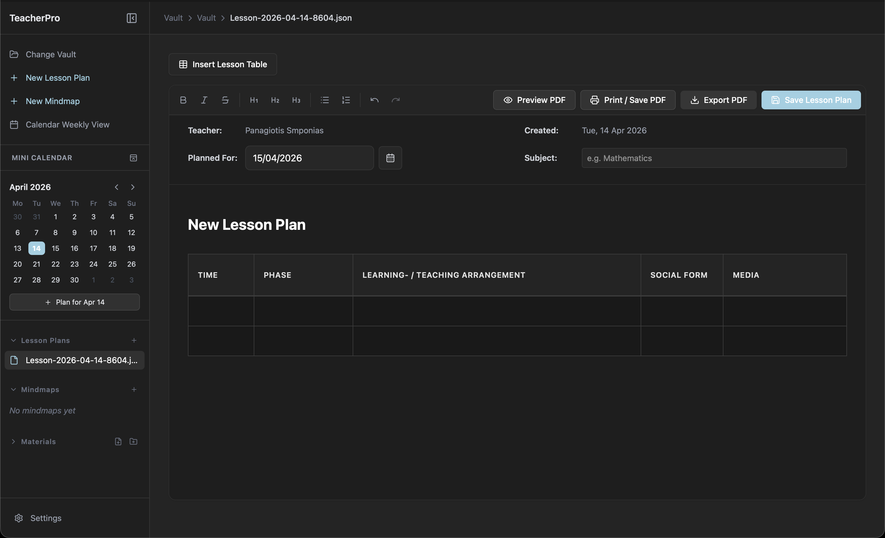

# TeacherPro 🎓

[](https://creativecommons.org/licenses/by-nc/4.0/)
[](https://github.com/Panolix/TeacherPro/actions)
[](#)

TeacherPro is a local-first, privacy-focused desktop application designed specifically for educators, tutors, and teachers. It tightly integrates a rich-text lesson plan editor, a weekly calendar for scheduling, material/file management, and interactive mindmapping into one seamless workspace.

Built with performance and cross-platform compatibility in mind using **Tauri**, **React**, **Tailwind CSS**, and **Rust**.

<p align="center">
  
</p>

<table align="center" width="100%">
  <tr>
    <td align="center" width="50%">
      
      <br>
      <b>📝 Lesson Plan Editor</b><br>Rich text and specialized data tables.
    </td>
    <td align="center" width="50%">
      
      <br>
      <b>🧠 Mindmap Editor</b><br>Create fluid, visual curriculums.
    </td>
  </tr>
  <tr>
    <td align="center" width="50%">
      
      <br>
      <b>📅 Weekly Calendar View</b><br>See your upcoming week at a glance.
    </td>
    <td align="center" width="50%">
      
      <br>
      <b>🖨️ PDF Preview & Print</b><br>Export flawless natively-styled sheets.
    </td>
  </tr>
</table>

---

## ✨ Features & Settings Guide

TeacherPro is packed with purpose-built tools designed to adapt to your teaching workflow. Here is a breakdown of what you can do:

### 🗂️ The Vault System (Local-First)
- **100% Local Storage:** First, you select a "Vault" folder anywhere on your computer. TeacherPro saves all your lessons, mindmaps, and materials directly into this folder. No cloud accounts, no sync issues.
- **Portability:** Everything is saved as lightweight `.json` files. You can safely back up your Vault to a USB drive or cloud folder (like Google Drive or Dropbox) without breaking the app.
- **Smart Breadcrumbs:** The top navigation bar intelligently displays your exact location relative to your Vault.

### 📝 Lesson Plan Editor
- **Rich Text Formatting:** Powered by TipTap, the editor supports Headings, Bold, Italic, Strikethrough, Underline, Unordered/Ordered lists, text color, underline color, and multicolor highlighting.
- **Specialized Lesson Tables:** Insert pre-formatted pedagogy tables tracking *Time, Phase, LTA (Learning/Teaching Activity), Social Form, and Media*. You can dynamically add/remove rows and columns, and resize them freely.
- **Metadata Management:** Easily track the *Teacher Name*, *Creation Date*, and use a built-in calendar popup to set the *Planned Date*.
- **Autosave + Manual Save:** Changes are automatically saved in the background, and you can still trigger a manual save anytime.
- **Material Linking:** Drag and drop external files (PDFs, Word Docs, Images) directly into the editor to create clickable links. Double-clicking the link opens the file in your computer's default native application.

### 🧠 Mindmap Editor
- **Infinite Canvas:** Build visual curriculums using a node-based interface (powered by React Flow).
- **Drag-and-Drop Connectivity:** Create nodes, double-click to rename them, and drag connections between them to map out concepts.
- **Color Workflow:** Right-click any standard node to apply fast preset colors or use a custom color picker; text and border contrast are auto-adjusted for readability.
- **Material Nodes:** You can drag and drop external files directly onto the mindmap surface to create dedicated file nodes.
- **Context Menus:** Right-click anywhere on the canvas or on specific nodes to access quick-actions (Delete, Add Node).

### 📅 Weekly Calendar View
- **Visual Scheduling:** See your upcoming week at a glance.
- **Quick Reset to Current Week:** Use the built-in *Today* button to jump back instantly after browsing future/past weeks.
- **Easy Access:** Click on any scheduled lesson directly from the calendar to instantly open it in the editor.

### 🧭 Sidebar Productivity Tools
- **Fast Search (On Demand):** Open per-section search fields from the magnifier icon when needed, then filter Lesson Plans and Mindmaps by file names and indexed document content.
- **Material Search:** Find copied/imported materials quickly by file name or nested relative path.
- **Duplicate Plan:** Right-click any lesson and duplicate it for recurring classes.
- **Safe Deletion + Recovery:** Deleted lessons/mindmaps/materials are moved to the Vault's `Trash` folder, where you can restore items later or permanently delete them.
- **Rendered Trash Preview:** Lesson plans and mindmaps inside Trash can be previewed in rendered form (not raw JSON) before restoring.

### 🖨️ Native Printing & PDF Export
- **Flawless UI Capture:** TeacherPro uses a custom canvas engine to perfectly capture the exact colors, table borders, and layouts of your lesson plans and mindmaps—ensuring your printed sheets look exactly like your screen.
- **Native OS Print Dialogs:** Built with a custom Rust backend, clicking "Print" seamlessly opens the native Windows, macOS, or Linux print dialogs, avoiding standard webview limitations.
- **Export to PDF:** Save beautifully formatted PDF versions of your documents directly into your Vault's `Exports` folder.

### ⚙️ UI & Customization
- **Accent Colors:** Personalize your workspace! The default theme is a soft TeacherPro blue (`#9fd2e4`), but you can change the accent color to match your preference.
- **Custom Accent Picker:** In addition to presets, you can choose any custom accent color directly from the settings color picker.
- **Dark & Light Modes:** Full support for dark and light environments. Automatically switches or can be forced via settings.
- **Independent Paper Tones:** Set Lesson Plan paper and Mindmap paper to White or Dark independently from the global app theme.
- **Collapsible Sidebar:** Keep your workspace clean by collapsing the sidebar and individual sections (Lesson Plans, Mindmaps, Materials).
- **Compact Action Buttons:** Save/Preview/Print/Export actions are icon-first by default, with an optional setting to show text labels.

---

## 🚀 Use Cases
- **Teachers**: Plan your entire semester ahead of time, attaching the exact PDF worksheets or slideshows you need right next to the lesson structure. 
- **Tutors**: Generate customized PDF summaries and study mindmaps to export and hand back to your students after a session.
- **Professors**: Keep research and lecture materials tightly organized and visually mapped without relying on messy folder structures.

---

## 📦 Installation

Pre-compiled, ready-to-run installers for **Windows**, **macOS**, and **Linux** are available in the [Releases](https://github.com/Panolix/TeacherPro/releases) tab.

### 🍎 macOS Users: "App is damaged" Error
Because TeacherPro is an open-source app and not currently signed with a paid Apple Developer certificate, macOS Gatekeeper may flag the downloaded app as "damaged" and tell you to move it to the trash. 

To fix this and run the app safely:
1. Move `TeacherPro.app` (from the downloaded `.dmg`) to your **Applications** folder.
2. Open your Mac's **Terminal** app.
3. Run the following command to remove the quarantine flag:
   ```bash
   xattr -cr /Applications/TeacherPro.app
   ```
4. You can now open TeacherPro normally!

*(Note: Replace the link above with your actual GitHub repository URL once published!)*

---

## 🛠 Building from Source

If you want to build the project yourself or contribute:

### Prerequisites
1. **Node.js**: v20 or higher.
2. **Rust**: Install the latest stable Rust toolchain via [rustup](https://rustup.rs/).
3. **Tauri System Dependencies**: Specifically required if building on Linux. Check the [Tauri Prerequisites guide](https://v2.tauri.app/start/prerequisites/).

### Development Setup

Clone the repository and install the frontend dependencies:
```bash
git clone https://github.com/Panolix/TeacherPro.git
cd TeacherPro
npm install
```

Start the local development server (with hot-reloading):
```bash
npm run tauri dev
```

Build the final native application executable for your current OS:
```bash
npm run tauri build
```
The compiled files will appear under `src-tauri/target/release/bundle/`.

---

## 📜 Documentation & Architecture

TeacherPro uses a live documentation system to track design decisions, remaining gaps, and app features. If you are developing or modifying the codebase, please refer to:
- [FEATURE_TRACKER.md](FEATURE_TRACKER.md) - The single source of truth for the codebase function map, UX decisions, and recently completed tasks.
- [PROJECT_PLAN.md](PROJECT_PLAN.md) - The initial architectural phase planning map.

---

## ⚖️ License

**Creative Commons Attribution-NonCommercial 4.0 International (CC BY-NC 4.0)**

You are free to **download**, **use**, **modify**, and **share** this software! However, you must adhere to the following conditions:

- **Attribution**: You must give appropriate credit to the original author, provide a link to the license, and indicate if any changes were made.
- **NonCommercial**: You may **not** use the material for commercial purposes (you cannot sell this software or use it within a commercial product without explicit permission or profit-sharing arrangements).

See the [LICENSE](LICENSE) file for the full legal text.
