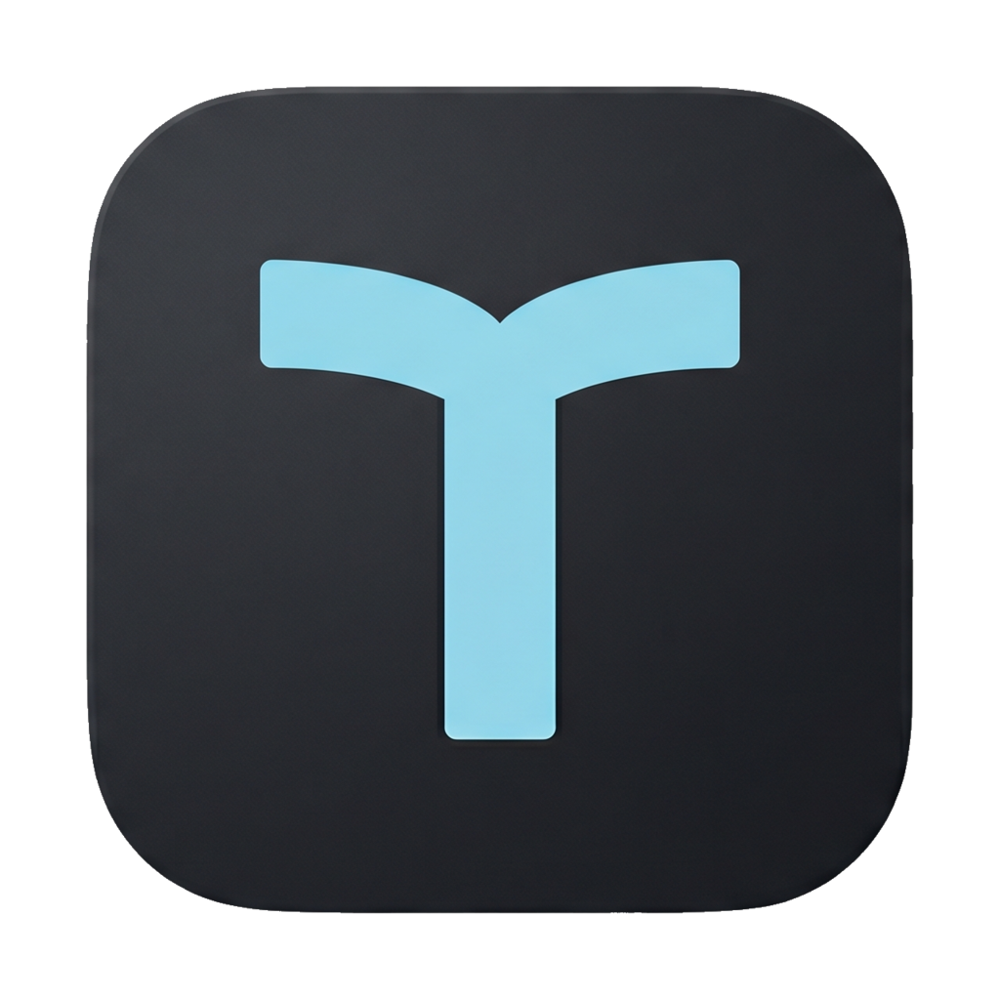
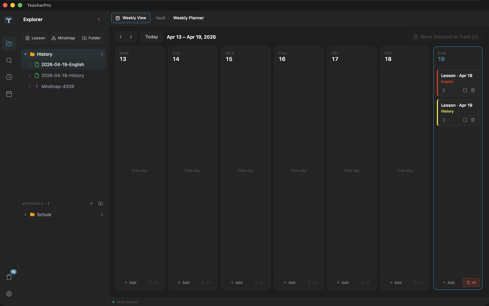
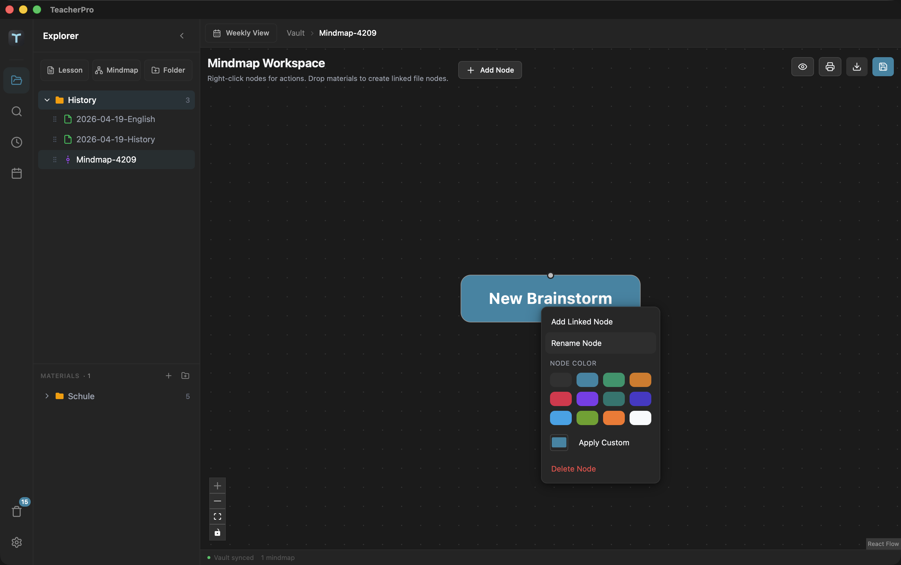
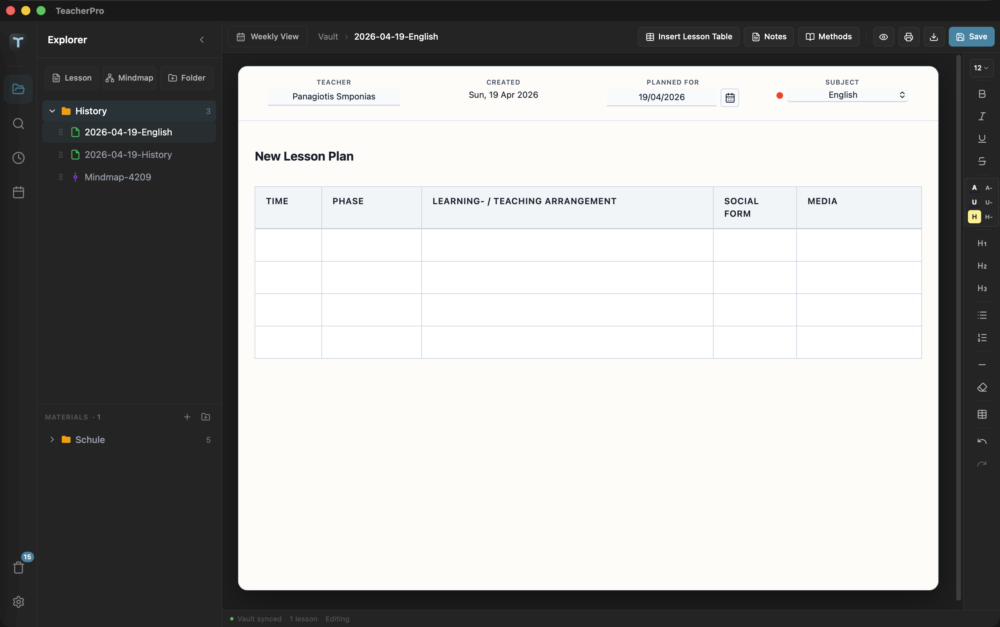
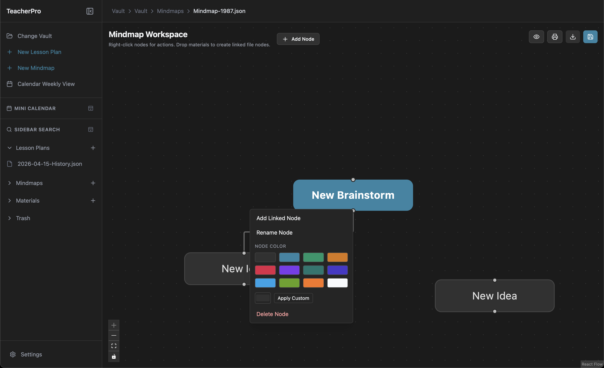
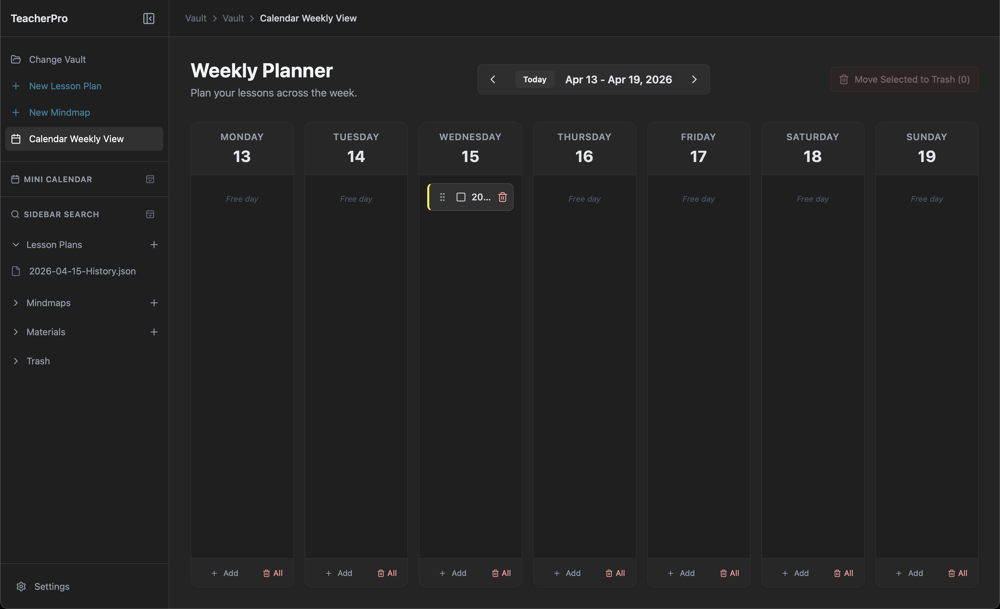
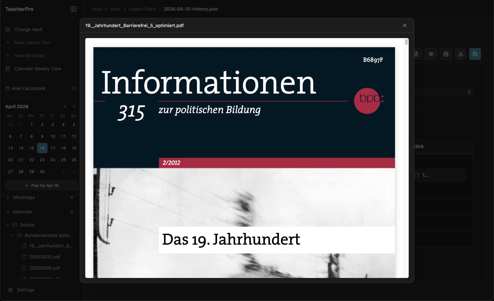
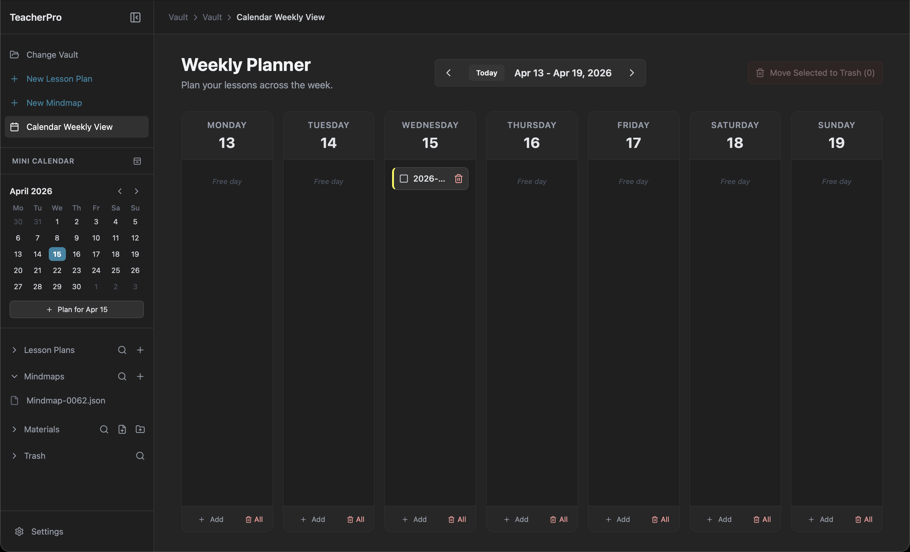
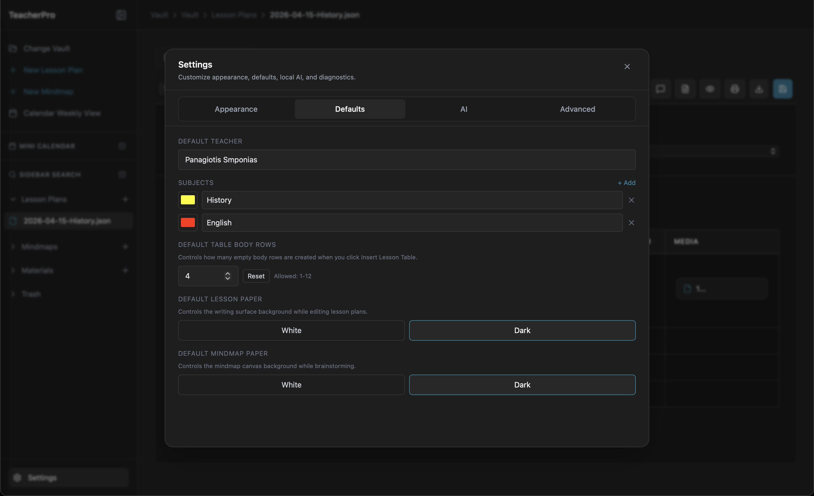
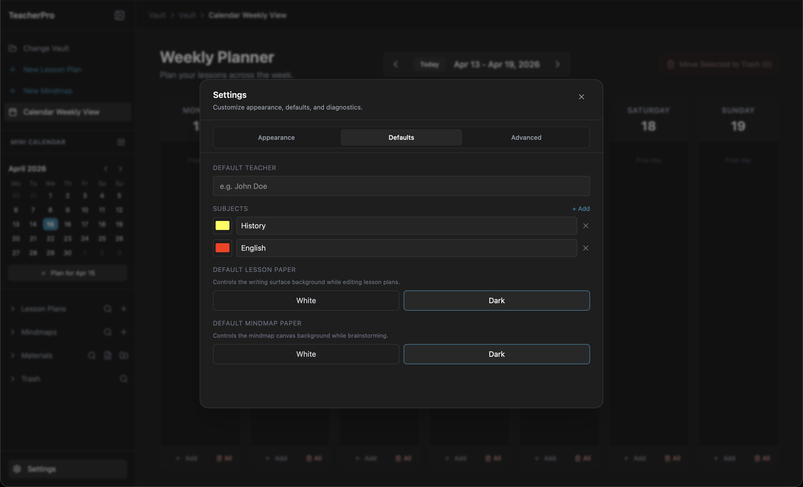

# TeacherPro 🎓

[](https://creativecommons.org/licenses/by-nc/4.0/)
[](https://github.com/Panolix/TeacherPro/actions)
[](#)

TeacherPro is a local-first, privacy-focused desktop application designed specifically for educators, tutors, and teachers. It tightly integrates a rich-text lesson plan editor, a weekly calendar for scheduling, material/file management, and interactive mindmapping into one seamless workspace.

Built with performance and cross-platform compatibility in mind using **Tauri**, **React**, **Tailwind CSS**, and **Rust**.

<p align="center">
  
</p>

<h2 align="center">Product Tour</h2>

<p align="center">
  A quick visual walkthrough of TeacherPro from lesson creation to AI help, planning, export, and settings.
</p>

<table align="center">
  <tr>
    <td colspan="3" align="center"><b>Lesson Planning Core</b></td>
  </tr>
  <tr>
    <td align="center" width="33%">
      <br>
      <b>1) Lesson Plan Editor</b><br>
      <sub>Structured lesson workspace with metadata, formatting tools, and pedagogy tables.</sub>
    </td>
    <td align="center" width="33%">
      <br>
      <b>2) AI Chat Sidebar</b><br>
      <sub>Ask for summaries, activity ideas, and improvements without leaving your lesson draft.</sub>
    </td>
    <td align="center" width="33%">
      <br>
      <b>3) Private Notes Sidebar</b><br>
      <sub>Keep lesson-only notes in a dedicated drawer that stays out of print and PDF exports.</sub>
    </td>
  </tr>
  <tr>
    <td colspan="3" align="center"><b>Organize and Deliver</b></td>
  </tr>
  <tr>
    <td align="center" width="33%">
      <br>
      <b>4) Mindmap Workspace</b><br>
      <sub>Build connected ideas visually with node links, color presets, and quick right-click actions.</sub>
    </td>
    <td align="center" width="33%">
      <br>
      <b>5) Weekly Planner</b><br>
      <sub>Plan your week at a glance and manage lessons directly in day-based columns.</sub>
    </td>
    <td align="center" width="33%">
      <br>
      <b>6) Material Preview</b><br>
      <sub>Preview source files like PDFs before linking them into lessons and classroom plans.</sub>
    </td>
  </tr>
  <tr>
    <td colspan="3" align="center"><b>Export and Configure</b></td>
  </tr>
  <tr>
    <td align="center" width="33%">
      <br>
      <b>7) Print and PDF Preview</b><br>
      <sub>Check final output before printing or saving polished lesson documents to PDF.</sub>
    </td>
    <td align="center" width="33%">
      <br>
      <b>8) Defaults Settings</b><br>
      <sub>Set teacher defaults, subject colors, and paper preferences for faster daily setup.</sub>
    </td>
    <td align="center" width="33%">
      <br>
      <b>9) AI Runtime Diagnostics</b><br>
      <sub>See local AI runtime health, backend selection, and model routing in one panel.</sub>
    </td>
  </tr>
</table>

---

## ✨ Features & Settings Guide

TeacherPro is packed with purpose-built tools designed to adapt to your teaching workflow. Here is a breakdown of what you can do:

### 🗂️ The Vault System (Local-First)
- **100% Local Storage:** First, you select a "Vault" folder anywhere on your computer. TeacherPro saves all your lessons, mindmaps, and materials directly into this folder. No cloud accounts, no sync issues.
- **Portability:** Everything is saved as lightweight `.json` files. You can safely back up your Vault to a USB drive or cloud folder (like Google Drive or Dropbox) without breaking the app.
- **Smart Breadcrumbs:** The top navigation bar intelligently displays your exact location relative to your Vault.

### 📝 Lesson Plan Editor
- **Rich Text Formatting:** Powered by TipTap, the editor supports Headings, Bold, Italic, Strikethrough, Underline, Unordered/Ordered lists, text color, underline color, and multicolor highlighting.
- **Specialized Lesson Tables:** Insert pre-formatted pedagogy tables tracking *Time, Phase, LTA (Learning/Teaching Activity), Social Form, and Media*. You can dynamically add/remove rows and columns, resize them freely, and set the default inserted body-row count in Settings.
- **Metadata Management:** Easily track the *Teacher Name*, *Creation Date*, and use a built-in calendar popup to set the *Planned Date*.
- **Autosave + Manual Save:** Changes are automatically saved in the background, and you can still trigger a manual save anytime.
- **Contextual AI Chat Dock:** Toggle AI chat directly from the editor action buttons; when active, it opens as a slide-out side dock so it remains visible while you work.
- **Private Lesson Notes Drawer:** Open a dedicated notes panel per lesson from the editor header action row (right next to AI Chat). It uses the same left-side dock area as AI Chat, with only one panel open at a time. Notes autosave with the lesson, are searchable locally, and stay out of print/PDF export by default.
- **Method Bank Pedagogy Drawer:** Open a third optional dock panel from the same lesson action row to browse teaching phases, social forms, and methods. It shares the same left-side dock footprint as AI Chat and Notes, stays mutually exclusive with them, supports double-click insertion into mapped lesson-table columns when the cursor is inside a lesson-table body row, and supports contextual `/` suggestions inside table cells.
- **Stable Editor Button Order:** The dock toggles in the lesson action row stay ordered as AI Chat (leftmost), then Notes, then Method Bank.
- **Readable Workspace Density:** The main sidebar and all lesson side docks are slightly wider, while surrounding workspace padding is reduced to maximize useful space without shrinking core editor or mindmap surfaces.
- **Material Linking:** Double-click a material entry in the sidebar to insert a clickable media link into the lesson table's media column for the active row (when cursor focus is inside a lesson-table body row). Double-clicking an inserted link opens the file in your computer's default native application.

### 🧠 Mindmap Editor
- **Infinite Canvas:** Build visual curriculums using a node-based interface (powered by React Flow).
- **Drag-and-Drop Connectivity:** Create nodes, double-click to rename them, and drag connections between them to map out concepts.
- **Color Workflow:** Right-click any standard node to apply fast preset colors or use a custom color picker; text and border contrast are auto-adjusted for readability.
- **Material Nodes:** You can drag and drop external files directly onto the mindmap surface to create dedicated file nodes.
- **Context Menus:** Right-click anywhere on the canvas or on specific nodes to access quick-actions (Delete, Add Node).

### 📅 Weekly Calendar View
- **Visual Scheduling:** See your upcoming week at a glance.
- **Quick Reset to Current Week:** Use the built-in *Today* button to jump back instantly after browsing future/past weeks.
- **Easy Access:** Click on any scheduled lesson directly from the calendar to instantly open it in the editor.
- **Drag to Reschedule:** Drag a lesson card to another day column to move it. TeacherPro updates the lesson's planned date and file date so it appears under the new day immediately.

### 🧭 Sidebar Productivity Tools
- **Unified Smart Search:** Open one collapsible search block in the sidebar and filter Lesson Plans, Mindmaps, Materials, and Trash from a single query (including indexed document content for lessons/mindmaps).
- **Material Search:** Find copied/imported materials quickly by file name or nested relative path.
- **Duplicate Plan:** Right-click any lesson and duplicate it for recurring classes.
- **Safe Deletion + Recovery:** Deleted lessons/mindmaps/materials are moved to the Vault's `Trash` folder, where you can restore items later or permanently delete them.
- **Rendered Trash Preview:** Lesson plans and mindmaps inside Trash can be previewed in rendered form (not raw JSON) before restoring.
- **Centered Settings Workspace:** Settings now open in a dedicated centered modal with clearer spacing, professional section tabs, and ESC/backdrop close behavior.

### 🖨️ Native Printing & PDF Export
- **Flawless UI Capture:** TeacherPro uses a custom canvas engine to perfectly capture the exact colors, table borders, and layouts of your lesson plans and mindmaps—ensuring your printed sheets look exactly like your screen.
- **Native OS Print Dialogs:** Built with a custom Rust backend, clicking "Print" seamlessly opens the native Windows, macOS, or Linux print dialogs, avoiding standard webview limitations.
- **Export to PDF:** Save beautifully formatted PDF versions of your documents directly into your Vault's `Exports` folder.

### ⚙️ UI & Customization
- **Accent Colors:** Personalize your workspace! The default theme is a deeper TeacherPro blue (`#2d86a5`) for better in-app readability, and you can still change the accent color to match your preference.
- **Custom Accent Picker:** In addition to presets, you can choose any custom accent color directly from the settings color picker.
- **Dark Mode Focus:** TeacherPro now runs with a dark app shell for consistent readability and reduced visual drift across screens.
- **Independent Paper Tones:** Set Lesson Plan paper and Mindmap paper to White or Dark independently from the global app theme.
- **Viewport-Safe Context Menus:** Right-click menus in sidebar, editor tables, mindmaps, and material links auto-reposition near window edges so actions remain fully visible.
- **Stable Scrolling Layout:** Scrollbar gutters are stabilized to avoid content width shifts while scrolling; scrollbar visuals are slimmer and neutral gray.
- **Collapsible Sidebar:** Keep your workspace clean by collapsing the sidebar and individual sections (Lesson Plans, Mindmaps, Materials).
- **Compact Action Buttons:** AI Chat, Save, Preview, Print, and Export actions are icon-first by default, with an optional setting to show text labels.

### 🤖 Local AI Assistant (Experimental Foundation)
- **Local-First Runtime:** AI integration is being implemented on top of Tauri with local model execution (no required cloud account).
- **Model Catalog:** Includes current practical local families (Gemma 4, Qwen 3, Llama 3.2, DeepSeek R1 8B, Mistral Small 3.1, Phi 4) with per-model disk/RAM/VRAM guidance and runtime defaults.
- **Capability Chips:** Model cards provide neutral capability hints (`reasoning`, `multilingual`, `low-latency`, `long-context`, `english-focused`) instead of hard recommendations.
- **Thinking Mode Awareness:** Chat thinking toggle is model-aware and only sends thinking requests for supported models.
- **No Terminal Popups (Windows):** Runtime setup, model installs, imports, and chat-related runtime calls execute with hidden process flags so random command windows do not flash while using AI features.
- **Runtime Diagnostics Panel:** AI Settings now show runtime availability, server status, preferred backend, detected hardware, and active model processor usage from `ollama ps` (for example, CPU-only vs GPU usage).
- **Cross-Platform Backend Strategy:**
  - Windows: prefers `cuda` when NVIDIA tooling is detected, otherwise CPU fallback.
  - macOS Intel + Apple Silicon: prefers `metal`.
  - Linux: prefers `cuda` for NVIDIA, `rocm` for AMD ROCm environments, otherwise CPU fallback.
  - Hybrid GPU systems: when backend is `cuda`, inference targets NVIDIA GPUs (for example, RTX 4090) instead of integrated AMD graphics.
- **Direct Download Mode:** You can use download-only mode so Install opens external Gemma 4 download pages (Hugging Face / Kaggle) without starting or managing Ollama.
- **Settings Integration:** A new AI settings tab is available for enable/disable, chat persistence policy, default model selection, and model install/remove actions with progress + cancel.
- **Settings Durability:** UI preferences are persisted in app storage and mirrored to a Vault backup file (`.teacherpro/ui-settings.backup.json`) for easier recovery across app updates.
- **Source Discovery:** AI settings include quick links to external Gemma catalogs (e.g., Hugging Face and Kaggle) for newer variants.
- **Privacy Boundary:** Lesson and mindmap content remains in your Vault; AI runtime metadata is managed outside the Vault.

---

## 🚀 Use Cases
- **Teachers**: Plan your entire semester ahead of time, attaching the exact PDF worksheets or slideshows you need right next to the lesson structure. 
- **Tutors**: Generate customized PDF summaries and study mindmaps to export and hand back to your students after a session.
- **Professors**: Keep research and lecture materials tightly organized and visually mapped without relying on messy folder structures.

---

## 📦 Installation

Pre-compiled, ready-to-run installers for **Windows**, **macOS**, and **Linux** are available in the [Releases](https://github.com/Panolix/TeacherPro/releases) tab.

### 🔖 Automated Release Flow (Recommended)

TeacherPro now uses a tag-driven release pipeline with version synchronization across:

- `package.json`
- `package-lock.json`
- `src-tauri/Cargo.toml`
- `src-tauri/tauri.conf.json`

To publish a new installer release:

1. Prepare notes in `RELEASE_NOTES_vX.Y.Z.md` (for example `RELEASE_NOTES_v1.2.2.md`).
2. Push your code changes.
3. Create and push a matching tag:

   ```bash
   git tag v1.2.2
   git push origin v1.2.2
   ```

4. GitHub Actions workflow **Release** builds installers for Windows, macOS, and Linux and uploads them as assets to the draft release.

If you need to rebuild installers for an existing version tag, run **Build Installers** manually from the Actions tab and provide `version` (without the `v` prefix, e.g. `1.2.2`).

### 🍎 macOS Users: "App is damaged" Error
Because TeacherPro is an open-source app and not currently signed with a paid Apple Developer certificate, macOS Gatekeeper may flag the downloaded app as "damaged" and tell you to move it to the trash. 

To fix this and run the app safely:
1. Move `TeacherPro.app` (from the downloaded `.dmg`) to your **Applications** folder.
2. Open your Mac's **Terminal** app.
3. Run the following command to remove the quarantine flag:
   ```bash
   xattr -cr /Applications/TeacherPro.app
   ```
4. You can now open TeacherPro normally!

*(Note: Replace the link above with your actual GitHub repository URL once published!)*

---

## 🛠 Building from Source

If you want to build the project yourself or contribute:

### Prerequisites
1. **Node.js**: v20 or higher.
2. **Rust**: Install the latest stable Rust toolchain via [rustup](https://rustup.rs/).
3. **Tauri System Dependencies**: Specifically required if building on Linux. Check the [Tauri Prerequisites guide](https://v2.tauri.app/start/prerequisites/).

### Development Setup

Clone the repository and install the frontend dependencies:
```bash
git clone https://github.com/Panolix/TeacherPro.git
cd TeacherPro
npm install
```

Start the local development server (with hot-reloading):
```bash
npm run tauri dev
```

Build the final native application executable for your current OS:
```bash
npm run tauri build
```
The compiled files will appear under `src-tauri/target/release/bundle/`.

---

## 📜 Documentation & Architecture

TeacherPro uses a live documentation system to track design decisions, remaining gaps, and app features. If you are developing or modifying the codebase, please refer to:
- [FEATURE_TRACKER.md](FEATURE_TRACKER.md) - The single source of truth for the codebase function map, UX decisions, and recently completed tasks.
- [PROJECT_PLAN.md](PROJECT_PLAN.md) - The initial architectural phase planning map.
- [AI_IMPLEMENTATION_PLAN.md](AI_IMPLEMENTATION_PLAN.md) - The implementation roadmap and acceptance criteria for local AI features.

---

## ⚖️ License

**Creative Commons Attribution-NonCommercial 4.0 International (CC BY-NC 4.0)**

You are free to **download**, **use**, **modify**, and **share** this software! However, you must adhere to the following conditions:

- **Attribution**: You must give appropriate credit to the original author, provide a link to the license, and indicate if any changes were made.
- **NonCommercial**: You may **not** use the material for commercial purposes (you cannot sell this software or use it within a commercial product without explicit permission or profit-sharing arrangements).

See the [LICENSE](LICENSE) file for the full legal text.
